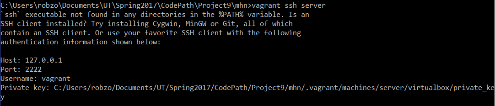
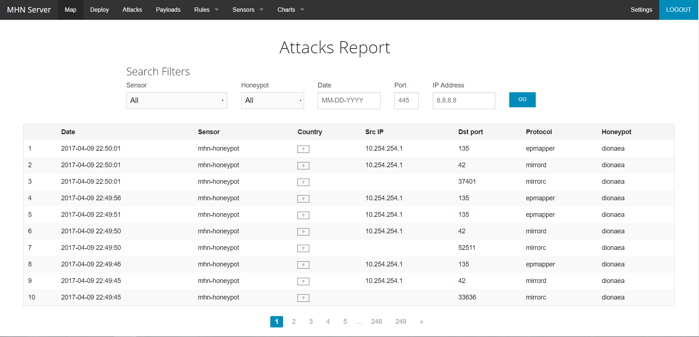
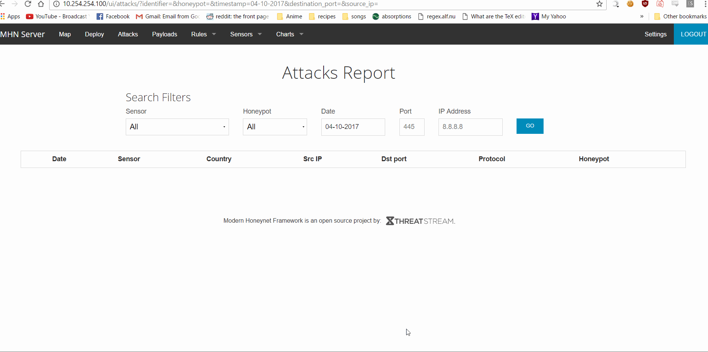

# Project 10 - Honeypot

Time spent: **X** hours spent in total

> Objective: Setup a honeypot and provide a working demonstration of its features.

### Required: Overview & Setup

- [X] A basic writeup (250-500 words) on the `README.md` desribing the overall approach, resources/tools used, findings
- [X] A specific, reproducible honeypot setup, ideally automated. There are several possibilities for this:
	- A Vagrantfile or Dockerfile which provisions the honeypot as a VM or container
	- A bash script that installs and configures the honeypot for a specific OS
	- Alternatively, **detailed** notes added to the `README.md` regarding the setup, requirements, features, etc.

### Required: Demonstration

- [X] A basic writeup of the attack (what offensive tools were used, what specifically was detected by the honeypot)
- [X] An example of the data captured by the honeypot (example: IDS logs including IP, request paths, alerts triggered)
- [X] A screen-cap of the attack being conducted
    
### Optional: Features
- Honeypot
	- [ ] HTTPS enabled (self-signed SSL cert)
	- [ ] A web application with both authenticated and unauthenticated footprint
	- [ ] Database back-end
	- [ ] Custom exploits (example: intentionally added SQLI vulnerabilities)
	- [ ] Custom traps (example: modified version of known vulnerability to prevent full exploitation)
	- [ ] Custom IDS alert (example: email sent when footprinting detected)
	- [ ] Custom incident response (example: IDS alert triggers added firewall rule to block an IP)
- Demonstration
	- [ ] Additional attack demos/writeups
	- [ ] Captured malicious payload
	- [ ] Enhanced logging of exploit post-exploit activity (example: attacker-initiated commands captured and logged)

Honeypot setup description:
Modern Honey Network sets up two virtual machines containing a honeypot server and a management server.
In the Honeypot server, you can deploy sensors with intrusion detection software including Snort, Kippo, Conpot, and Dionaea.
In the Management server, you can view attack logs and manage snort rules.
The Honeypot server also uses the Management server to download scripts, connect and register, download snort rules, and send intrusion detection logs.
We use VirtualBox to create the virtual machines and use Vagrant to configure them.
We use PuTTY to SSH into the servers. 
We use the browser to use the MHN admin console.

How to reproduce the honeypot setup:	
On Windows

Install Vagrant, Git

Clone Modern Honey Network (MHN) into a folder
"git clone https://github.com/threatstream/mhn.git"
In file explore, go into folder mhn.
"cd mhn"
Open command prompt in current folder (shift + right click -> Open command window here) and run Vagrantfile
"vagrant up"
This creates two VMs:
honeypot - the honeypot VM
server - the VM running the admin console for monitoring data collected by the honeypot

Verify the two VMs are running with
"vagrant global-status"

Get SSH info
"vagrant ssh server"

SSH into server
Start PuTTY
Enter Host Name: 127.0.0.1
Enter Port: 2222
Set Connection type: SSH
In Category on the left side, under Connection, select Data
Set Auto-login username: vagrant
Under Connection, under SSH, select Auth
Browse for private key for authentication: C:/Users/robzo/Documents/UT/Spring2017/CodePath/Project9/mhn/.vagrant/machines/server/virtualbox/private_key
Back in Session, save as vagrant session
Open
password is vagrant

In the server VM
"sudo su -"
"apt-get install -y git"

"cd /opt/"
"git clone https://github.com/0x7fff9/mhn.git"
"cd mhn"
"git checkout 0x7fff9-encoding_patch"

From /opt/mhn, launc the pre-requisite install scripts:
"cd scripts"
"./install_hpfeeds.sh ; ./install_mnemosyne.sh ; ./install_honeymap.sh"

To make sure geoloc, honeymap, hpfeeds-broker, and mnemosyne are running.
"supervisorctl status" 

Check if the mnemosyne config option ignore_rfc1918 is False
"vi /opt/mnemosyne/mnemosyne.cfg"
and scroll to the bottom.

If you made changes to the config file, restart mnemosyne and run final server install script.
"supervisorctl restart mnemosyne"
"./install_mhnserver.sh"

Do you wish to run in Debug mode?: y/n n
Superuser email: YOUR-EMAIL@YOUR-SITE.com
Superuser password: 
Superuser password: (again): 
Server base url ["http://1.2.3.5"]: http://10.254.254.100
Honeymap url ["http://1.2.3.5:3000"]: http://10.254.254.100:3000
Mail server address ["localhost"]: 
Mail server port [25]: 
Use TLS for email?: y/n y
Use SSL for email?: y/n y
Mail server username [""]:  
Mail server password [""]: 
Mail default sender [""]: 
Path for log file ["/var/log/mhn/mhn.log"]: 

On the host machine, navigate to the MHN admin console in a browser at http://10.254.254.100 and login with email/password you set in previous step

Go to Deploy page and in the Select Script drop-down menu, select Ubuntu - Dionaea and copy the Deploy Command snippet. Dionaea is a low-interaction honeypot designed to trap malware.
wget "http://70.114.223.87/api/script/?text=true&script_id=2" -O deploy.sh && sudo bash deploy.sh http://70.114.223.87 JM7zR20k

SSH into your honeypot 
Open another instance of PuTTY, load vagrant session, change port to 2200, and press Open

Switch user, paste, change, and execute the Deploy Command you copied from the admin console
"sudo su -"
Paste this "wget "http://70.114.223.87/api/script/?text=true&script_id=2" -O deploy.sh && sudo bash deploy.sh http://70.114.223.87 JM7zR20k"
Change to this "wget "http://10.254.254.100/api/script/?text=true&script_id=2" -O deploy.sh && sudo bash deploy.sh http://10.254.254.100 JM7zR20k"
Press enter.

The script will prompt you twice with "File to Patch:"
Type "/etc/dionaea/dionaea.conf" and "/usr/lib/dionaea/python/dionaea/ihandlers.py" respectively

On the host machine, verify dionaea has been set up correctly by navigating to the Sensors page, where you should see mhn-honeypot-dionaea

Start Kali on a VM.
Run nmap on the honeypot.
"nmap -sV -P0 10.254.254.101"

After nmap finishes, go to your browser that is connected to the MHN admin console and navigate to the Attacks page.
You should see info on the nmap scan.

The attack was an nmap scan. The program nmap on Kali linux in a virtual machine was used to conduct the attack. Protocols used by nmap (epmapper, mirrorc), the destination port, and the source ip address were detected by the honeypot.

